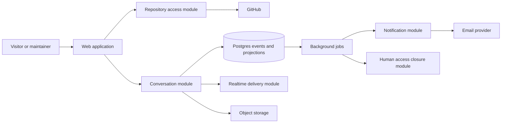
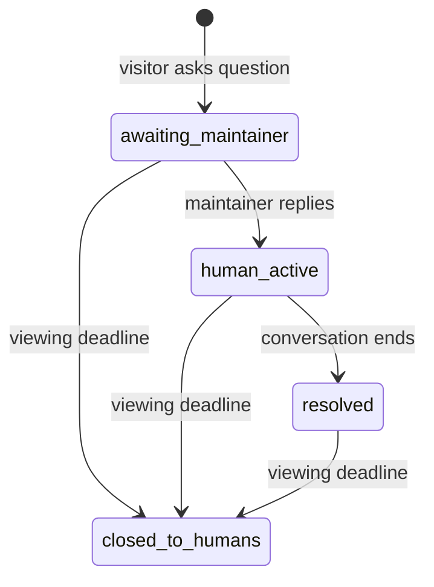

# Knock Knock — Product and Technical Plan

## Product definition

Knock Knock is a private support inbox attached to a GitHub repository. A README
badge takes a visitor through GitHub authentication and directly into a private
conversation with that repository's verified maintainers. The conversation later
disappears from human view, but its complete log remains privately retained for
future paid AI support and AI-generated FAQs.

### Recommended interpretation of "room"

A repository is one **inbox**, and each visitor starts a separate private
**conversation** inside it. A conversation is visible only to its visitor and
verified maintainers of the repository.

This preserves the simplicity of one repository = one destination without
turning support questions into a public community chat.

## MVP outcomes

The MVP is successful when:

1. Visiting `/owner/repo` for any public GitHub repository works without project
   creation or prior maintainer setup.
2. A visitor can authenticate with GitHub and ask a question from the badge in
   under a minute.
3. The question appears immediately to the visitor and verified maintainers.
4. The first authenticated administrator can claim the repository and generate a
   README badge without creating a workspace.
5. Maintainers can reply, receive one useful email notification, and promote a
   conversation to a GitHub issue or Markdown export.
6. Human access closes automatically at the configured viewing deadline.
7. The complete log remains intact in restricted storage and cannot be reopened
   through any human-facing product surface.

## MVP cut line

### Include

- GitHub identity for all visitors and maintainers
- Zero-setup discovery of public repositories
- Repository administration verification and first-maintainer claim
- Public GitHub repositories
- One private conversation per visitor visit
- Markdown, code fences, syntax highlighting, and image attachments
- Real-time messages, typing state, basic presence, and delivery/read state
- Maintainer inbox with awaiting-reply filtering
- Email notification for new conversations
- Promotion to GitHub issue and Markdown export
- Configurable human viewing window with a 14-day recommended default
- Complete private log retention after the human viewing window
- Clear pre-send disclosure linking to the privacy notice
- Badge generator and README instructions
- Essential operational and product metrics

### Defer

- Private repositories
- GitHub Discussions promotion
- Slack, Discord, and generic webhooks
- Emoji reactions
- Cross-conversation search UI
- All AI behavior, model dependencies, retrieval, embeddings, and analytics
- Entropy scoring and promotion recommendations
- Paid accounts, billing, commercial plans, and custom branding
- Native mobile apps
- Public rooms, threads, channels, and social features

The deferred items should not require a rewrite, but they should not add seams or
configuration to the first release until a second adapter or real use case exists.

## Core flows

### Zero-setup repository and maintainer claim

1. Any valid public `owner/repo` URL resolves from GitHub and gets a default,
   unclaimed repository record when first used.
2. A maintainer signs in with GitHub from that page.
3. Knock Knock asks GitHub for that user's current repository permission.
4. The first user with `admin` permission becomes the Knock Knock owner.
5. They accept the viewing-window/notification defaults and copy the generated
   badge.
6. If a later action needs repository write permission, ask for the narrow GitHub
   App installation at that moment.

Claiming does not make the room exist; it only enables maintainer controls. The
claim stores GitHub's stable IDs and verification time, and privileged actions
always recheck current permission.

### Visitor question

1. Open `/owner/repo` from the README badge and see repository identity, current
   maintainer availability/typical response time, and a focused composer.
2. Authenticate with GitHub and return to the same repository URL.
3. Ask a question; the server persists and broadcasts it immediately.
4. The conversation becomes `awaiting_maintainer` and the notification job runs.
5. Continue in real time until the visitor leaves or the human viewing window
   closes.

### Maintainer response and promotion

1. Open the inbox and filter to conversations awaiting a human.
2. Reply in the same conversation.
3. Optionally promote the conversation to a GitHub issue or download Markdown.
4. Store the resulting URL/export audit record. The human viewing window still
   closes, and the complete private log remains retained.

## System shape

Start as a modular monolith with a web process and a worker process built from the
same codebase. Postgres is the source of truth. This is simple to operate while
leaving clean deployment seams for real-time fanout and background work.



### Suggested technical baseline

- TypeScript monorepo with a React web application and a long-running Node server
- PostgreSQL for users, repositories, event streams, projections, and jobs
- S3-compatible object storage for image attachments
- WebSockets for active conversations, with reconnect and catch-up over HTTP
- A Postgres-backed job runner for notifications and human-access closure
- GitHub App user authorization for identity; public GitHub data for zero-setup
  repository content; installation tokens only for narrowly scoped write actions
  and webhooks
- One transactional outbox so persisted events reliably trigger jobs and
  real-time delivery

Do not add Redis initially. Introduce a realtime pub/sub adapter only when a
second web instance makes cross-process fanout necessary. Presence and typing are
ephemeral signals; correctness must not depend on them.

GitHub separates authorizing an App for user identity from installing it on a
repository. Authorized App user tokens can read public resources implicitly;
installed-App permissions govern repository actions such as issue writes. The
admin-without-install verification remains a deliberate milestone-0 spike rather
than an assumed capability. See GitHub's documentation on
[App authorization](https://docs.github.com/en/apps/using-github-apps/authorizing-github-apps),
[App permissions](https://docs.github.com/en/apps/creating-github-apps/registering-a-github-app/choosing-permissions-for-a-github-app),
and [repository permission lookup](https://docs.github.com/en/rest/collaborators/collaborators#get-repository-permissions-for-a-user).

## Deep modules and interfaces

Each module owns its rules and is tested through its interface. Framework routes,
database access, GitHub calls, and provider SDKs remain implementation details.

### Repository access module

Interface:

```text
openRepository(owner/repo) -> RepositoryContext
claimRepository(actor, repository) -> ClaimedRepository
```

It hides public repository discovery, GitHub identity lookup, renamed
repositories, optional installation state, permission caching, public/private
checks, and maintainer authorization. Milestone 0 must prove the exact GitHub
authorization call used to verify `admin` without requiring an installation.

### Conversation module

Interface:

```text
startConversation(actor, repository) -> Conversation
postMessage(actor, conversation, content) -> MessageReceipt
markRead(actor, conversation, throughMessage) -> ReadState
getConversation(actor, conversation, afterCursor?) -> ConversationView
```

It owns participant visibility, state transitions, message ordering, idempotency,
attachment association, event persistence, and the outbox write. The returned
receipt is enough for clients to reconcile optimistic UI.

### Notification module

Interface:

```text
notifyAwaitingMaintainer(conversation) -> NotificationResult
```

It owns recipient selection, deduplication, batching, quiet periods, retry policy,
and provider formatting. The MVP has email production and capture-test adapters.

### Promotion module

Interface:

```text
promote(actor, conversation, target) -> PromotionResult
```

It owns authorization, redaction preview, Markdown rendering, idempotency, GitHub
issue creation, and promotion audit data.

### Human access closure module

Interface:

```text
closeDueConversations(now, limit) -> ClosureBatch
```

It owns viewing-window eligibility, removal from every human-facing query,
session revocation, attachment URL revocation, retry behavior, and auditable
closure counts. It preserves the complete underlying log and attachments.

## Data and event model

Core records:

- `users`: stable GitHub user ID, current login, avatar, timestamps
- `repositories`: stable GitHub repository ID, current slug, optional installation,
  owner claim, and policy
- `repository_memberships`: cached permission and verification timestamp
- `conversations`: repository, visitor user, status, human-visible-until, human
  access closed timestamp, last activity
- `conversation_participants`: authenticated users admitted to the conversation
- `conversation_events`: ordered per-conversation event stream
- `conversation_messages`: query projection for rendered messages
- `conversation_reads`: per-participant cursor
- `attachments`: owner, private object key, media metadata, scan state, human
  access closed timestamp
- `promotions`: target, external identifier/URL, status, timestamps
- `outbox` and `jobs`: reliable asynchronous work

Initial event types:

- `ConversationStarted`
- `MessagePosted`
- `MaintainerReplyPosted`
- `ReadCursorAdvanced`
- `ConversationPromoted`
- `ViewingWindowChanged`
- `HumanAccessClosed`

The event stream, message projection, participant records, and attachments form
the complete retained log. They are retained indefinitely by default after the
human viewing window closes. Closing human access is an authorization and product
visibility transition, not deletion.

The primary lifecycle is deliberately small:



Promotion is a separate record, not a conversation status. It may happen from any
authenticated human state and does not stop the viewing window or private log
retention.

## Paid AI after MVP

AI is a paid repository-account capability and is not part of the MVP. The MVP
must contain no model SDK, prompt, repository indexing, embedding, AI event,
entitlement check, placeholder response, or disabled AI interface.

When paid accounts are implemented, their visitors may receive an optional AI
first response before maintainers are notified. The same paid capability may
synthesize FAQ entries from patterns in the retained logs without exposing source
transcripts. That work gets its own product contract, threat model, retrieval and
de-identification design, evaluation suite, publication policy, and module
interface based on what has been learned from real human conversations.

The retained corpus exists solely for those future support-agent and FAQ purposes.
It is not a human conversation archive, advertising dataset, or general-purpose
model-training corpus.

## Security and privacy invariants

- Use stable GitHub numeric IDs; logins and repository slugs can change.
- Recheck maintainer permission before viewing an inbox, replying, exporting, or
  promoting. A short cache may improve latency but cannot grant stale access for
  sensitive operations.
- Authorize every conversation query by participant or current maintainer status
  and reject it after `human_visible_until`, regardless of role.
- Use OAuth state, PKCE where supported, secure cookies, CSRF protection, and
  strict redirect allow-lists.
- Sanitize rendered Markdown and never execute uploaded content.
- Validate attachment type/size, scan uploads, and serve them from an isolated
  origin using short-lived URLs.
- Require authentication on every conversation route and send
  `X-Robots-Tag: noindex, nofollow, noarchive`; never include conversation URLs in
  public sitemaps.
- Encrypt retained logs and attachments, and reserve decryption access after the
  viewing window for a dedicated future machine role. Do not build a human archive
  browser or content lookup tool.
- Never duplicate message bodies, access tokens, or repository contents into
  analytics or operational application logs.
- Show a concise retention disclosure with a link to `PRIVACY.md` before the first
  message is sent.
- Make human-access closure idempotent and measure late closures or URLs that
  remain usable after their deadline.

## Delivery milestones

### 0. Product contract and foundation

- Confirm the decisions at the end of this document.
- Prototype GitHub authorization to prove admin verification without an App
  installation; fall back to a no-scope OAuth identity flow if necessary.
- Initialize the repository, CI, local environment, migrations, and deployment
  skeleton.
- Record architecture decisions for GitHub App auth, private conversation
  visibility, indefinite private log retention, and machine-only future access.

Exit: one command starts the app and database; CI verifies format, types, tests,
and migrations.

### 1. GitHub-native doorway

- Public repository resolution with no project setup
- GitHub sign-in and callback return path that preserves the target repository
- Admin verification and first-maintainer ownership claim
- Stable `/owner/repo` routing and renamed-repository handling
- Maintainer controls and badge generator

Exit: an arbitrary public repository URL reaches a composer, and a verified admin
can claim it and generate a badge without installing an App.

### 2. Human conversation vertical slice

- Conversation/event persistence and participant authorization
- Markdown/code messages and image attachments
- WebSocket updates with reconnect/cursor catch-up
- Maintainer inbox and reply flow
- Basic typing, presence, delivery, and read state

Exit: two browsers can complete a private visitor/maintainer conversation without
refreshing, and an unauthorized user cannot discover it.

### 3. Support workflow

- Postgres-backed jobs, retries, and transactional outbox
- Deduplicated maintainer email notification
- Maintainer availability and typical response-time display
- Awaiting-reply filters and conversation resolution

Exit: a new question reliably notifies the right maintainer once, presence sets
visitor expectations, and the inbox accurately reflects reply state.

### 4. Promotion and human access closure

- Redaction/preview and GitHub issue promotion
- Markdown export
- Repository viewing-window setting and closure worker
- Pre-send retention disclosure and privacy notice
- Search-engine exclusion headers and sitemap checks
- Restricted long-term log and attachment storage

Exit: promotion is idempotent; a closed fixture conversation is inaccessible from
every human-facing route and attachment URL while its complete log remains intact
in restricted storage.

### 5. Launch hardening

- Rate limits, abuse reporting, and upload scanning
- Accessibility, mobile layout, reconnect behavior, and latency work
- Encrypted backups with the same purpose and access restrictions as primary logs
- Operational dashboards, alerts, runbooks, and closed beta onboarding

Exit: production readiness review passes and 5–10 repositories can run a closed
beta with measured question and response outcomes.

## Verification strategy

- Domain tests through each module interface for permissions, ordering,
  idempotency, state transitions, promotion, and human-access closure
- Integration tests against real Postgres and S3-compatible local storage
- Contract tests for GitHub webhooks and provider adapters using recorded fixtures
- Browser tests for badge → OAuth → question and inbox → reply → promote
- Load tests for reconnect storms, hot repositories, and slow consumers
- A closure test that inventories every human route and attachment URL after the
  viewing deadline, while separately verifying retained-log integrity

## Product metrics

- Badge click → question conversion
- Time from badge open to first question
- OAuth completion rate and duration
- Median human response time
- Visitor return/read rate after a reply
- Promotion rate by target
- Notification deduplication/retry failures
- Human-access closure lag and post-deadline access failures
- Retained-log and attachment integrity

Optimize for how quickly a visitor can ask, receive a useful human response, and
leave—not for engagement or conversation volume.

## Decisions to confirm

Recommended defaults are shown first.

1. **AI scope:** no AI is built for MVP. It becomes an optional paid capability
   for repository accounts in a later release.
2. **Authentication:** every visitor signs in with GitHub before starting a
   conversation; there are no anonymous sessions or passwords.
3. **Conversation visibility:** each conversation is private to the visitor and
   verified maintainers, never a shared public chat.
4. **Repository scope:** public repositories for MVP; private repository support
   follows after the permission and data-handling model is proven.
5. **GitHub integration:** authorization verifies identity and, if the technical
   spike succeeds, admin permission; an App installation is requested only when a
   feature needs repository write access or webhooks.
6. **Human viewing-window default:** 14 days emphasizes disappearance; the
   README's earlier MVP section says 30 days, so this needs an explicit product
   choice.
7. **Promotion:** GitHub issue + Markdown export in MVP; Discussions and FAQ
   follow.
8. **Complete log retention:** full logs and attachments remain privately retained
   after human access closes, solely for future paid AI support and AI-generated
   FAQs. There is no automatic storage-deletion deadline.
9. **After promotion:** the human viewing window still closes; both the private
   retained log and the external GitHub/export copy continue to exist.
10. **Implementation:** TypeScript modular monolith, Postgres, and object storage;
   no Redis or microservices until load requires them.
