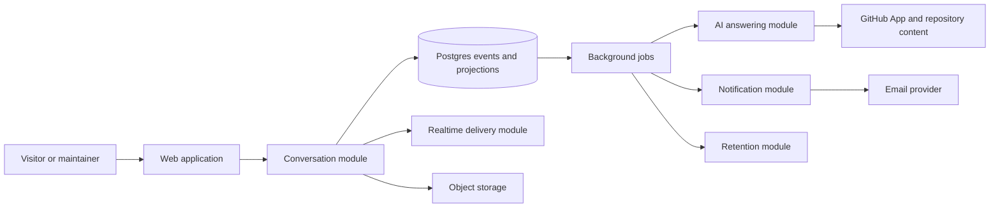
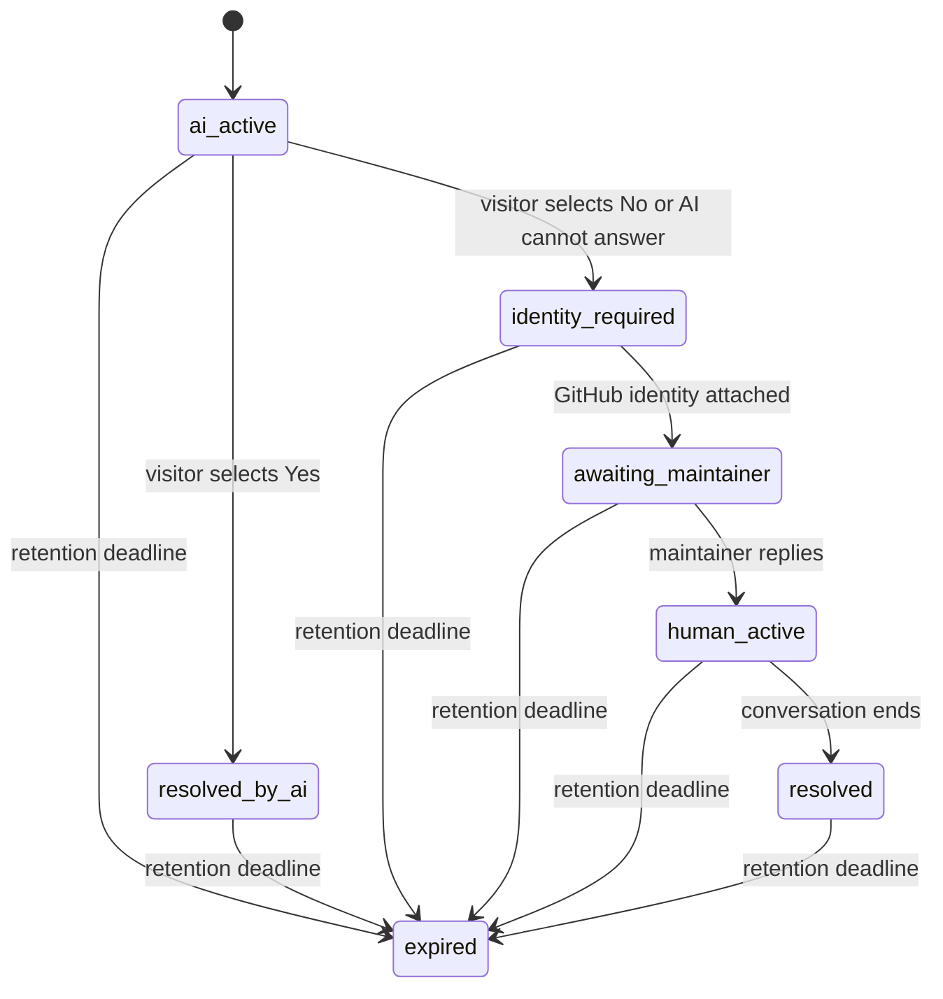

# Knock Knock — Product and Technical Plan

## Product definition

Knock Knock is an ephemeral support inbox attached to a GitHub repository. A
README badge opens a public AI receptionist trained on that repository. If the
answer does not help, the visitor authenticates with GitHub and the same exchange
becomes a private conversation with the repository's verified maintainers.

### Recommended interpretation of "room"

A repository is one **inbox**, and each visitor starts a separate
**conversation** inside it. "Public AI" means anyone can start an AI-only session,
not that transcripts are public. Once escalated, a conversation is visible only
to its participants and verified maintainers of the repository.

This preserves the simplicity of one repository = one destination without
turning support questions into a public community chat.

## MVP outcomes

The MVP is successful when:

1. Visiting `/owner/repo` for any public GitHub repository works without project
   creation or prior maintainer setup.
2. A visitor can ask the AI a question from the badge in under a minute.
3. AI either posts an answer with repository citations or offers to involve a
   maintainer.
4. On escalation, the visitor signs in with GitHub and the question appears
   immediately to verified maintainers.
5. The first authenticated administrator can claim the repository and generate a
   README badge without creating a workspace.
6. Maintainers can reply, receive one useful email notification, and promote a
   conversation to a GitHub issue or Markdown export.
7. The complete conversation and its attachments are physically deleted at the
   retention deadline unless the repository's policy changes the deadline.

## MVP cut line

### Include

- Public AI-only sessions before sign-in
- GitHub identity on escalation and for all maintainer actions
- Zero-setup discovery of public repositories
- Repository administration verification and first-maintainer claim
- Public GitHub repositories
- One private conversation per visitor visit
- Markdown, code fences, syntax highlighting, and image attachments
- Real-time messages, typing state, basic presence, and delivery/read state
- AI answers grounded in the repository README and `docs/`
- Maintainer inbox with awaiting-reply filtering
- Email notification after AI escalation
- Promotion to GitHub issue and Markdown export
- Configurable retention with a 14-day recommended default
- Badge generator and README instructions
- Essential operational and product metrics

### Defer

- Private repositories
- GitHub Discussions promotion
- Slack, Discord, and generic webhooks
- Emoji reactions
- Cross-conversation search UI
- Weekly AI analytics and documentation suggestions
- Entropy scoring and automatic promotion recommendations
- Billing, commercial plans, and custom branding
- Native mobile apps
- Public rooms, threads, channels, and social features

The deferred items should not require a rewrite, but they should not add seams or
configuration to the first release until a second adapter or real use case exists.

## Core flows

### Zero-setup repository and maintainer claim

1. Any valid public `owner/repo` URL resolves from GitHub and gets a default,
   unclaimed repository record when first used.
2. A maintainer signs in with GitHub from that page.
3. Knock Knock asks GitHub for that user's current repository permission.
4. The first user with `admin` permission becomes the Knock Knock owner.
5. They accept the retention/notification defaults and copy the generated badge.
6. If a later action needs repository write permission, ask for the narrow GitHub
   App installation at that moment.

Claiming does not make the room exist; it only enables maintainer controls. The
claim stores GitHub's stable IDs and verification time, and privileged actions
always recheck current permission.

### Visitor question

1. Open `/owner/repo` from the README badge and see repository identity, current
   maintainer availability/typical response time, and a focused composer.
2. Ask the public AI receptionist without signing in.
3. Receive a cited answer and choose **Yes** or **No** for "Did this help?"
4. **Yes** ends the interaction. **No** starts GitHub authorization and returns to
   the same conversation.
5. The server attaches the verified GitHub identity, marks the conversation
   `awaiting_maintainer`, and notifies maintainers.
6. Continue in real time until the visitor leaves or the conversation expires.

### Maintainer response and promotion

1. Open the inbox and filter to conversations awaiting a human.
2. Reply in the same conversation.
3. Optionally promote the conversation to a GitHub issue or download Markdown.
4. Store the resulting URL/export audit record; retention still removes the
   local message content.

## System shape

Start as a modular monolith with a web process and a worker process built from the
same codebase. Postgres is the source of truth. This is simple to operate while
leaving clean deployment seams for real-time fanout and background work.



### Suggested technical baseline

- TypeScript monorepo with a React web application and a long-running Node server
- PostgreSQL for users, repositories, event streams, projections, jobs, and
  vector search
- S3-compatible object storage for image attachments
- WebSockets for active conversations, with reconnect and catch-up over HTTP
- A Postgres-backed job runner for AI, notifications, indexing, and retention
- GitHub App user authorization for identity; public GitHub data for zero-setup
  repository content; installation tokens only for narrowly scoped write actions
  and webhooks
- OpenAI behind an injected AI adapter
- One transactional outbox so persisted events reliably trigger jobs and
  real-time delivery

Do not add Redis initially. Introduce a realtime pub/sub adapter only when a
second web instance makes cross-process fanout necessary. Presence and typing are
ephemeral signals; correctness must not depend on them.

GitHub separates authorizing an App for user identity from installing it on a
repository. Authorized App user tokens can read public resources implicitly;
installed-App permissions govern repository actions such as issue writes. The
admin-without-install verification remains a deliberate milestone-0 spike rather
than an assumed capability. See GitHub's documentation on
[App authorization](https://docs.github.com/en/apps/using-github-apps/authorizing-github-apps),
[App permissions](https://docs.github.com/en/apps/creating-github-apps/registering-a-github-app/choosing-permissions-for-a-github-app),
and [repository permission lookup](https://docs.github.com/en/rest/collaborators/collaborators#get-repository-permissions-for-a-user).

## Deep modules and interfaces

Each module owns its rules and is tested through its interface. Framework routes,
database access, GitHub calls, and provider SDKs remain implementation details.

### Repository access module

Interface:

```text
openRepository(owner/repo) -> RepositoryContext
claimRepository(actor, repository) -> ClaimedRepository
```

It hides public repository discovery, GitHub identity lookup, renamed
repositories, optional installation state, permission caching, public/private
checks, and maintainer authorization. Milestone 0 must prove the exact GitHub
authorization call used to verify `admin` without requiring an installation.

### Conversation module

Interface:

```text
startConversation(browserSession, repository) -> Conversation
postMessage(actor, conversation, content) -> MessageReceipt
identifyVisitor(browserSession, githubActor) -> Conversation
markRead(actor, conversation, throughMessage) -> ReadState
getConversation(actor, conversation, afterCursor?) -> ConversationView
```

It owns participant visibility, state transitions, message ordering, idempotency,
attachment association, event persistence, and the outbox write. The returned
receipt is enough for clients to reconcile optimistic UI.

### AI answering module

Interface:

```text
attemptAnswer(conversation, visitorMessage) -> Answered | Escalated
```

It hides retrieval, prompt construction, model calls, citation validation,
confidence policy, and safe failure. `Escalated` is a normal result, not an error.
It uses production adapters for GitHub/OpenAI and deterministic adapters in tests.

### Notification module

Interface:

```text
notifyAwaitingMaintainer(conversation) -> NotificationResult
```

It owns recipient selection, deduplication, batching, quiet periods, retry policy,
and provider formatting. The MVP has email production and capture-test adapters.

### Promotion module

Interface:

```text
promote(actor, conversation, target) -> PromotionResult
```

It owns authorization, redaction preview, Markdown rendering, idempotency, GitHub
issue creation, and promotion audit data.

### Retention module

Interface:

```text
expireDueConversations(now, limit) -> ExpirationBatch
```

It owns eligibility, event/message deletion, attachment deletion, derived AI data
deletion, retry/tombstone behavior, and auditable counts without retaining content.

## Data and event model

Core records:

- `users`: stable GitHub user ID, current login, avatar, timestamps
- `repositories`: stable GitHub repository ID, current slug, optional installation,
  owner claim, and policy
- `repository_memberships`: cached permission and verification timestamp
- `conversations`: repository, hashed browser-session key, optional visitor user,
  status, retention deadline, last activity
- `conversation_participants`: authenticated users admitted to the conversation
- `conversation_events`: ordered per-conversation event stream
- `conversation_messages`: query projection for rendered messages
- `conversation_reads`: per-participant cursor
- `attachments`: owner, object key, media metadata, scan state
- `promotions`: target, external identifier/URL, status, timestamps
- `outbox` and `jobs`: reliable asynchronous work
- `repository_documents`: source commit, path, chunks, embeddings

Initial event types:

- `ConversationStarted`
- `MessagePosted`
- `AIAnswerPosted`
- `AIAnswerAccepted`
- `AIEscalated`
- `VisitorIdentified`
- `ConversationForwarded`
- `MaintainerReplyPosted`
- `ReadCursorAdvanced`
- `ConversationPromoted`
- `RetentionDeadlineChanged`

Events are append-only during a conversation's lifetime, not immortal. Expiration
hard-deletes the stream, projections, attachments, and embeddings in a controlled
operation. This reconciles event sourcing with the product's deletion promise.

The primary lifecycle is deliberately small:



Promotion is a separate record, not a conversation status. It may happen from any
authenticated human state and does not stop local retention.

## AI behavior

The AI path is asynchronous:

1. Accept and persist the AI-only message under a short-lived, unguessable browser
   session; do not notify maintainers yet.
2. Retrieve only current README/`docs/` chunks for the public repository.
3. Generate an answer that attaches a source path and commit permalink to every
   repository-derived claim.
4. Validate that citations exist and were retrieved.
5. Post the answer only when the evidence and confidence policy pass.
6. Ask whether the answer helped. A **No** response initiates GitHub login; failed
   confidence can immediately offer the same handoff.
7. Only after verified login move to `awaiting_maintainer` and notify humans.

The confidence policy should be deterministic around the model: citation
coverage, retrieval quality, unsupported-claim checks, and explicit failure modes.
Do not trust a model's self-reported confidence score on its own.

## Security and privacy invariants

- Use stable GitHub numeric IDs; logins and repository slugs can change.
- Recheck maintainer permission before viewing an inbox, replying, exporting, or
  promoting. A short cache may improve latency but cannot grant stale access for
  sensitive operations.
- Authorize every conversation query by participant or current maintainer status.
- Use OAuth state, PKCE where supported, secure cookies, CSRF protection, and
  strict redirect allow-lists.
- Restrict repository retrieval to the resolved repository and pinned commit.
- Sanitize rendered Markdown and never execute uploaded content.
- Validate attachment type/size, scan uploads, and serve them from an isolated
  origin using short-lived URLs.
- Never place message bodies, access tokens, or repository contents in analytics
  or application logs.
- Make retention deletion idempotent and measure orphaned object cleanup.

## Delivery milestones

### 0. Product contract and foundation

- Confirm the decisions at the end of this document.
- Prototype GitHub authorization to prove admin verification without an App
  installation; fall back to a no-scope OAuth identity flow if necessary.
- Initialize the repository, CI, local environment, migrations, and deployment
  skeleton.
- Record architecture decisions for GitHub App auth, private conversation
  visibility, and deletable event streams.

Exit: one command starts the app and database; CI verifies format, types, tests,
and migrations.

### 1. GitHub-native doorway

- Public repository resolution with no project setup
- GitHub sign-in and callback return path that preserves the conversation
- Admin verification and first-maintainer ownership claim
- Stable `/owner/repo` routing and renamed-repository handling
- Maintainer controls and badge generator

Exit: an arbitrary public repository URL reaches a composer, and a verified admin
can claim it and generate a badge without installing an App.

### 2. Human conversation vertical slice

- Conversation/event persistence and participant authorization
- Markdown/code messages and image attachments
- WebSocket updates with reconnect/cursor catch-up
- Maintainer inbox and reply flow
- Basic typing, presence, delivery, and read state

Exit: with the AI adapter forced to escalate, two browsers can complete a private
visitor/maintainer conversation without refreshing, and an unauthorized user
cannot discover it.

### 3. AI and escalation

- README/`docs/` indexing by commit
- Retrieval, cited answer, validation, and explicit escalation
- Postgres-backed jobs, retries, and transactional outbox
- Deduplicated maintainer email notification

Exit: a fixture repository produces a cited answer for known questions and a
maintainer notification for unknown ones.

### 4. Promotion and ephemerality

- Redaction/preview and GitHub issue promotion
- Markdown export
- Repository retention setting and expiration worker
- Attachment/embedding cleanup and deletion audit metrics

Exit: promotion is idempotent and an expired fixture conversation leaves no
recoverable content in application storage.

### 5. Launch hardening

- Rate limits, abuse reporting, upload scanning, and prompt-injection tests
- Accessibility, mobile layout, reconnect behavior, and latency work
- Backups with a retention-compatible erasure policy
- Operational dashboards, alerts, runbooks, and closed beta onboarding

Exit: production readiness review passes and 5–10 repositories can run a closed
beta with measured response/AI/escalation outcomes.

## Verification strategy

- Domain tests through each module interface for permissions, ordering,
  idempotency, state transitions, promotion, and deletion
- Integration tests against real Postgres and S3-compatible local storage
- Contract tests for GitHub webhooks and provider adapters using recorded fixtures
- Browser tests for badge → AI answer, No → OAuth → private escalation, and inbox
  → reply → promote
- AI evaluations with answerable, ambiguous, stale, adversarial, and unanswerable
  repository questions
- Load tests for reconnect storms, hot repositories, and slow consumers
- A deletion test that inventories every storage location before and after expiry

## Product metrics

- Badge click → question conversion
- Time from badge open to first question
- Time from **No** to completed GitHub authentication
- AI cited-answer rate and later maintainer correction rate
- Escalation rate and median human response time
- Visitor return/read rate after an answer
- Promotion rate by target
- Notification deduplication/retry failures
- Retention deletion lag and orphaned attachment count

Avoid optimizing "AI solved" as a standalone vanity metric. A low correction rate
and a good visitor outcome matter more than deflection volume.

## Decisions to confirm

Recommended defaults are shown first.

1. **AI before auth:** anyone may start an unlisted, AI-only session; GitHub login
   is required only to bring in humans. This is the recommended reading of "make
   the AI public and the humans private," but it supersedes the earlier OAuth-first
   flow in the README.
2. **Conversation visibility:** each session is isolated; escalated conversations
   are private to the visitor and verified maintainers, never a shared public chat.
3. **Repository scope:** public repositories for MVP; private repository support
   follows after the permission and data-handling model is proven.
4. **GitHub integration:** authorization verifies identity and, if the technical
   spike succeeds, admin permission; an App installation is requested only when a
   feature needs repository write access or webhooks.
5. **Retention default:** 14 days emphasizes ephemerality; the README's earlier
   MVP section says 30 days, so this needs an explicit product choice.
6. **AI handoff:** AI handles the first exchange; humans are notified only after
   low confidence or a visitor's **No**, followed by GitHub login.
7. **Promotion:** GitHub issue + Markdown export in MVP; Discussions and FAQ
   follow.
8. **Retention after promotion:** local content still expires; GitHub/export is
   the durable copy controlled by the maintainer.
9. **Implementation:** TypeScript modular monolith, Postgres, and object storage;
   no Redis or microservices until load requires them.
