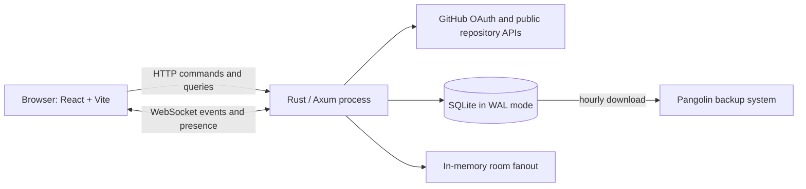

# Knock Knock — Product and Technical Plan

## Product contract

Knock Knock gives each active public GitHub repository one temporary, unnamed,
linear room.

Anyone may enter after authenticating with GitHub. Repository relationships are
displayed as affiliation pills, not used to restrict ordinary participation.
Messages remain visible for 14 days from posting and then disappear from all
normal human-facing queries. Complete plaintext records remain stored
indefinitely for future paid AI support and FAQ generation.

The MVP is free, single-process, and intentionally small.

## Settled MVP scope

### Include

- Public GitHub repositories
- GitHub OAuth before reading or posting
- One unnamed linear room per repository
- Room activation by GitHub `admin` or `maintain` users
- Prefilled GitHub Issue link for requesting activation of an unclaimed room
- Participation by any authenticated GitHub account
- Snapshotted repository-affiliation pills
- Markdown, fenced code, and sanitized links
- Optimistic, idempotent message submission
- Editing and user removal with retained revisions
- Presence for unique GitHub accounts
- Cursor-paginated visible history
- Message reporting, moderator hiding, repository mutes, and platform blocks
- Fourteen-day rolling human visibility derived at query time
- Indefinite plaintext retention of durable room records
- Search-engine exclusion and no global room discovery
- README badge generation

### Exclude

- Named or configurable channels
- Threads, Q&A, accepted answers, and wishlist structure
- Direct messages
- AI, retrieval, embeddings, FAQ generation, billing, and entitlements
- Email, mentions, digests, webhooks, Slack, and Discord notifications
- GitHub write access or automatic issue/discussion creation
- Conversation promotion and Markdown export
- Image/file uploads, media embeds, and link previews
- Reactions, typing indicators, read receipts, unread markers, and read tracking
- Search and global room directory
- Private repositories
- Strict event sourcing
- Multiple application processes, distributed fanout, and distributed rate limits
- A generic database abstraction or PostgreSQL compatibility layer

## Core flows

### Enter an active room

1. Visit `/owner/repo` through a badge, direct link, or repository URL entry.
2. Resolve the public repository using its stable GitHub repository ID.
3. If unauthenticated, complete GitHub OAuth and return to the same URL.
4. Recheck or refresh the user's repository relationship.
5. Load the newest 100 messages inside the 14-day window.
6. Connect one authenticated WebSocket for events and presence.
7. Load older visible pages when the user scrolls upward.

There is no last-read state. Every entry opens at the newest messages.

### Encounter an unclaimed room

1. Resolve and display public repository identity.
2. Do not reveal messages or accept posts.
3. Show a button that opens GitHub's new-issue page with a short activation
   request prefilled.
4. If GitHub Issues are unavailable, link to the repository without pretending
   the request was delivered.

Knock Knock does not call a GitHub write endpoint.

### Activate or deactivate

1. Require a current GitHub relationship of `admin` or `maintain`.
2. Record activation actor and time for audit, but create no local owner role.
3. Generate badge Markdown.
4. On deactivation, immediately reject new posts and hide all existing messages
   from human-facing reads.
5. Reactivation starts an empty visible room. Previously retained messages never
   return to the UI.

### Post a message

1. Client creates a UUID and optimistically displays the pending message.
2. Client sends a durable HTTP command with the UUID and raw Markdown.
3. Server validates session, active room, mute status, length, rate limit, and
   Markdown/link constraints.
4. In one SQLite transaction, insert the message, author-affiliation snapshot,
   and initial revision.
5. Return the authoritative integer sequence and UTC timestamp.
6. Broadcast the committed message over the room's in-memory channel.
7. Repeated HTTP submissions with the same user/message UUID return the original
   result instead of inserting a duplicate.

WebSocket delivery is at least once. Clients deduplicate by message ID and cursor.

### Edit or remove

- Authors may edit their own visible messages without an arbitrary edit deadline.
- Each edit appends a revision and marks the visible message `edited`.
- Author removal displays a tombstone until the original message leaves the
  14-day window.
- Original and revised bodies remain stored indefinitely.

### Moderate

- Any authenticated participant may report a visible message.
- Current GitHub `admin` or `maintain` users may hide messages and mute/unmute
  accounts in that repository.
- Operators may apply a platform-wide account block.
- Hidden messages display a moderation tombstone while they remain within the
  time window.
- Every moderation action records actor, target, reason, and timestamp.

## Identity and authority

GitHub is the only identity and repository-authority source.

### Sessions

- Use a rolling 30-day server-side session.
- Browser receives only an opaque `HttpOnly`, `Secure`, `SameSite=Lax` cookie.
- Store the GitHub OAuth token encrypted as an operational credential in SQLite.
- Never expose the token to frontend JavaScript.
- Revoke the session on logout or invalid OAuth state.
- Require exact same-origin `Origin` plus a frontend-only custom header on every
  mutating request.

### Relationship mapping

Snapshot one display pill when a message is posted:

| GitHub relationship | Display pill | May activate/configure/moderate |
| --- | --- | --- |
| Personal repository owner | `owner` | Yes |
| `admin` | `maintainer` | Yes |
| `maintain` | `maintainer` | Yes |
| `write` | `maintainer` | No |
| `triage` or explicit read collaborator | `collaborator` | No |
| No known affiliation | none | No |

The snapshot preserves what was true when the person spoke. Current permissions,
not the snapshot, authorize privileged actions.

### GitHub integration spike

Before building room activation, verify the narrowest OAuth flow that reliably
returns the authenticated user's effective relationship for both personal and
organization-owned public repositories. Prefer no requested scope beyond public
identity/repository information. Do not add GitHub write access.

If minimal OAuth cannot distinguish organization roles reliably, document the
exact additional read permission and its user-facing authorization text before
expanding scope.

## Human visibility and retained logs

### Visible query rule

For an active room, human-facing message reads require:

```text
message.created_at > server_now_utc - 14 days
```

Deactivation adds a room-level cutoff that hides every earlier message. No
expiration worker updates rows or deletes content.

### Retained durable records

Retain indefinitely by default:

- Messages and every revision
- Author removal and moderation state
- GitHub identity and affiliation snapshots
- Reports, mutes, blocks, and activation history
- Server ordering and timestamps

Do not persist presence, socket history, typing, read position, or link-preview
content. Do not duplicate message bodies into ordinary logs, traces, or metrics.

Storage is not cryptographically isolated from operators. The public promise is
that old content is absent from normal human-facing product views, not that it is
technically impossible for authorized operators to inspect storage.

## System shape

Start with one Atlas process and one SQLite file.



### Backend

- Rust
- Axum for HTTP routing, middleware, and WebSockets
- Tokio runtime
- SQLx with SQLite and embedded SQL migrations
- Serde JSON payloads
- Explicit SQL; no ORM
- One binary containing HTTP, WebSockets, and lightweight maintenance work

### Frontend

- TypeScript
- React
- Vite
- shadcn/ui
- Client-side routing
- Static assets built ahead of time and served by Axum
- Node is build-time only, not a production runtime

### SQLite

- One database for the whole application
- WAL mode
- Foreign keys enabled
- Busy timeout configured
- Short transactions
- Integer server sequence for message ordering and pagination
- Embedded forward-only migrations run before accepting traffic

Use SQLite directly. Localize queries inside backend modules but do not create a
generic database interface for a hypothetical future database.

### Backups

Existing infrastructure downloads the SQLite database from Atlas to Pangolin
hourly. Knock Knock contains no replication or backup scheduler. Test one restore
before launch. The free MVP promises no stronger durability guarantee.

## Backend modules

### GitHub identity module

```text
beginLogin(returnTo) -> AuthorizationRedirect
finishLogin(code, state) -> Session
resolvePublicRepository(owner, repo) -> Repository
relationship(actor, repository) -> GitHubRelationship
```

Owns OAuth state, session creation, repository rename handling, stable GitHub IDs,
relationship caching, and rate-limit behavior.

### Room module

```text
openRoom(actor, owner/repo, before?, limit) -> RoomView
activateRoom(actor, repository) -> Room
deactivateRoom(actor, room) -> Deactivation
```

Owns active/unclaimed state, authorization, 14-day visibility filtering,
pagination, and deactivation cutoff.

### Messaging module

```text
postMessage(actor, room, clientMessageId, markdown) -> MessageReceipt
editMessage(actor, message, markdown) -> Message
removeMessage(actor, message) -> MessageTombstone
```

Owns idempotency, validation, affiliation snapshots, ordering, revisions,
tombstones, transactions, and broadcast-after-commit.

### Moderation module

```text
reportMessage(actor, message, reason) -> Report
hideMessage(moderator, message, reason) -> MessageTombstone
muteUser(moderator, room, user, reason) -> Mute
```

Owns current-role checks, reports, room mutes, platform blocks, and moderation
audit records.

### Realtime module

```text
join(actor, room, afterCursor?) -> Connection
```

Owns WebSocket authentication, in-memory per-room broadcast, heartbeats,
connection cleanup, unique-user presence, and cursor hints. It owns no durable
message state.

## Data model

Initial tables:

- `users`: stable GitHub user ID, current login/avatar, timestamps
- `oauth_credentials`: encrypted token material and refresh metadata if applicable
- `sessions`: opaque session ID hash, user, expiry, last activity
- `repositories`: stable GitHub repository ID, current owner/name, public metadata
- `rooms`: repository, active state, activation/deactivation audit timestamps
- `relationship_cache`: user, repository, GitHub relationship, verified time
- `messages`: room, author, client UUID, server sequence, current visibility state,
  Markdown, created/edited/removed timestamps, affiliation pill snapshot
- `message_revisions`: message, revision number, Markdown, editor, timestamp
- `reports`: reporter, message, reason, state, timestamp
- `moderation_actions`: actor, room, message/user target, action, reason, timestamp
- `room_mutes`: room, user, actor, reason, active state, timestamps
- `platform_blocks`: user, actor, reason, active state, timestamps

Important constraints:

- Unique `(author_id, client_message_uuid)` for idempotency
- Monotonic integer message sequence for ordering/cursors
- Message length at most 8,000 Unicode characters
- URL length at most 2,048 characters
- No raw HTML
- UTC timestamps generated or verified by the server

## HTTP and realtime interface

Exact paths may change during implementation, but the interface shape is:

```text
GET    /api/rooms/:owner/:repo
GET    /api/rooms/:owner/:repo/messages?before=<cursor>&limit=100
POST   /api/rooms/:owner/:repo/messages
PATCH  /api/messages/:id
DELETE /api/messages/:id
POST   /api/messages/:id/reports
POST   /api/messages/:id/hide
POST   /api/rooms/:owner/:repo/mutes
DELETE /api/rooms/:owner/:repo/mutes/:userId
POST   /api/rooms/:owner/:repo/activate
POST   /api/rooms/:owner/:repo/deactivate
GET    /api/rooms/:owner/:repo/stream
```

Durable mutations use HTTP. The WebSocket emits committed message changes,
moderation changes, room deactivation, presence joins/leaves, and cursor hints.
Clients may receive duplicates and must deduplicate.

## Presence

- Count unique authenticated GitHub user IDs, not sockets.
- A user remains present while at least one socket is alive.
- Use heartbeat/pong tracking with a 45-second disconnect grace period.
- Broadcast total presence and affiliated-user joins/leaves.
- Do not store presence history.
- Do not expose IP addresses, number of tabs, or device details.

## Markdown and links

Allow:

- Paragraphs
- Emphasis
- Lists
- Blockquotes
- Inline code
- Fenced code blocks
- Links

Reject or ignore:

- Raw HTML
- Tables
- Task lists
- Embedded media
- Automatic link previews
- Dangerous URL schemes

Store and transmit raw Markdown. Render it into React elements with raw HTML
disabled and an explicit component allowlist. Validate URL schemes on server and
client.

## Abuse and security baseline

- Require GitHub authentication before returning room content.
- Rate-limit mutating endpoints per GitHub account and per IP using in-memory
  token buckets.
- Return `429` rather than silently dropping writes.
- Enforce room mutes and platform blocks before accepting a message.
- Use secure session cookies, OAuth state, strict return-URL validation, and exact
  same-origin checks.
- Send `X-Robots-Tag: noindex, nofollow, noarchive` on authenticated room pages.
- Exclude room routes from sitemaps and disallow them in `robots.txt` as defense
  in depth.
- Never log OAuth tokens, session cookies, message bodies, or moderation reasons
  in ordinary request logs.
- Escape/sanitize repository metadata and rendered Markdown.
- Set payload and request-body limits at the HTTP layer.

## Delivery milestones

### 0. Foundation and GitHub spike

- Create the Rust application and Vite/shadcn frontend
- Configure local SQLite, WAL pragmas, and migrations
- Build GitHub OAuth with opaque server sessions
- Prove relationship lookup for personal and organization public repositories
- Serve frontend assets from Axum
- Establish format, lint, test, and build checks

Exit: a GitHub user can sign in, return to a requested repository URL, and see
their resolved relationship without room content yet.

### 1. Room activation and doorway

- Resolve stable public repository identity and renamed slugs
- Render unauthenticated, unclaimed, and active room states
- Create prefilled activation-request issue link
- Implement `admin`/`maintain` activation and deactivation
- Generate README badge Markdown
- Add pre-post retention disclosure

Exit: an eligible user can activate a room without granting GitHub write access;
an ineligible visitor sees the request path.

### 2. Durable realtime room

- Add message/revision schema and cursor pagination
- Implement restricted Markdown and link-only rendering
- Add optimistic idempotent posting, editing, and removal
- Add WebSocket broadcast and reconnect catch-up
- Add unique-account presence
- Enforce 14-day query visibility

Exit: two authenticated GitHub users can exchange messages in real time, retry a
failed optimistic send safely, paginate history, and watch old fixture messages
fall outside the visible query.

### 3. Moderation and abuse controls

- Reporting
- Message hiding
- Repository mutes
- Platform blocks
- Per-account and per-IP rate limits
- Deactivation and non-resurrection tests
- Moderation UI for current `admin`/`maintain` users

Exit: abusive content can be removed from human view without destroying retained
records, and a muted account cannot post through HTTP or an existing socket.

### 4. Launch hardening

- Mobile and keyboard-accessible UI
- Reconnect, offline, and slow-network behavior
- OAuth/session threat review
- SQLite contention/load test
- Search-engine exclusion verification
- Pangolin restore exercise
- Operational metrics and minimal runbook

Exit: 5–10 public repositories can use the free beta on one Atlas process with
known operational limits.

## Verification strategy

- Module tests for role checks, activation, deactivation, visibility, edits,
  tombstones, mutes, and idempotency
- SQLite integration tests using real migrations and WAL configuration
- GitHub adapter contract fixtures for owner, admin, maintain, write, triage, read,
  unaffiliated, renamed, missing, and private repositories
- Browser tests for OAuth return, room activation, two-user chat, moderation, and
  deactivation
- Realtime tests for duplicate events, reconnect cursor, multi-tab presence, and
  disconnect grace
- Security tests for cross-room access, CSRF/origin rejection, unsafe Markdown,
  dangerous URLs, session fixation, and rate limits
- Visibility tests at the exact 14-day boundary using a controllable server clock
- Restore test from a Pangolin-downloaded SQLite backup

## Operational signals

Track without message content:

- OAuth success/failure and duration
- GitHub API errors and remaining rate budget
- Active rooms and unique connected users
- HTTP message latency and SQLite busy time
- WebSocket connections, disconnects, and broadcast failures
- Rate-limit hits, reports, hides, mutes, and blocks
- Messages excluded by the 14-day cutoff
- Backup age supplied by existing infrastructure if available

## Scaling posture

Do not optimize for scale yet.

The first pressure points are expected to be:

1. SQLite write contention
2. One-process WebSocket fanout
3. In-memory presence and rate limits
4. GitHub API rate budget

When measured load requires change, migrate deliberately:

- SQLite to a server database
- In-memory fanout/presence to shared pub/sub
- In-memory rate limits to shared state
- Single process to separate web and worker processes

Do not introduce those seams before a second implementation actually exists.

## Decisions intentionally deferred

- Paid AI behavior and provider
- FAQ generation and publication policy
- Billing and entitlements
- Notifications
- Attachments
- Multiple channels or threads
- Private repositories
- Search or directories
- Cross-device unread state
- Multi-region deployment
